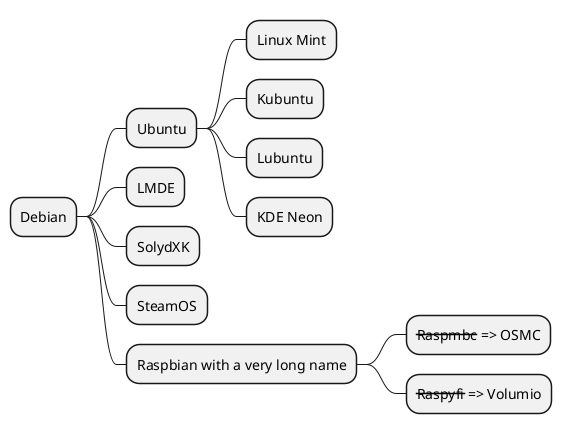

+++
title = "Test"
date = 2020-12-11T16:11:51+08:00
draft = true
toc = true
bootstrap = true
plantuml = true

[article_image]
    src = "images/hugo/gohugoio-card.jpg"
+++

## Shortcodes-Details

### 普通文本



> 我是隱藏的區塊內容



### 表格

| Name | Desc |
| ---- | ---- |
|  Apple, **banana**  | Ya |

## h2

### h21

hi

#### h22

## h22

ddd

## 中文

中文

### about 

## PlantUML

取的cdn腳本的資訊 "https://www.srihash.org" , 例如:

> ````

