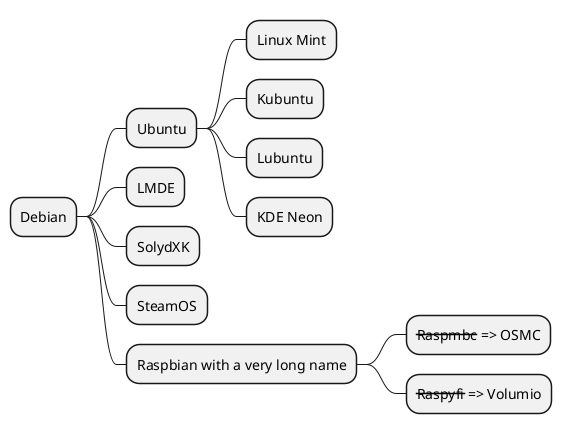

+++
title = "Test"
date = 2020-12-11T16:11:51+08:00
draft = true
toc = true
bootstrap = true
plantuml = true
markmap = true

[article_image]
    src = "images/hugo/gohugoio-card.jpg"
+++

## h2

h2

### h21

hi

#### h22


## h22

ddd

## 中文

中文

### about 

## PlantUML

取的cdn腳本的資訊 "https://www.srihash.org" , 例如:

> ``<script src="https://cdn.jsdelivr.net/npm/plantuml-encoder@1.4.0/dist/plantuml-encoder.min.js" integrity="sha256" crossorigin="anonymous"></script>``



## markmap測試

目前這個項目還沒有完成，

> :collision: js有先後順序front matter的markmap不能放在article_image之後！

```markmap
{"t":"heading","d":1,"p":{},"v":"教學", "c":[
  {"t":"heading","d":2,"p":{},"v":"<a href=\"https://markmap.js.org/repl/\">Hugo</a>"},
  {"t":"heading","d":2,"p":{},"v":"JS", "c":[
      {"t": "heading", "d":3, "p":{}, "v":"jquery"},
      {"t": "heading", "d":3, "p":{}, "v":"bootstrap"}
    ]
  }
]},
{"t":"heading","d":1,"p":{},"v":"科技", "c":[]}
```
