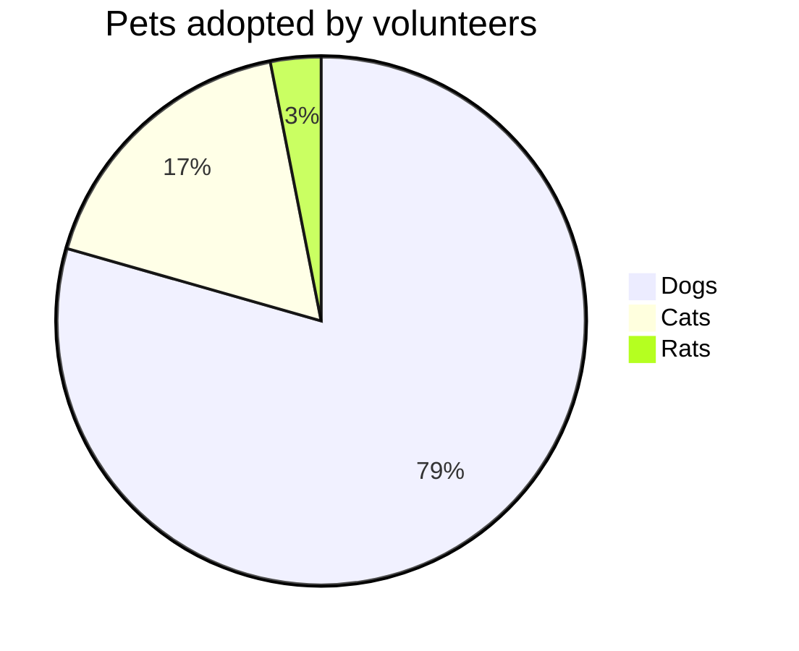
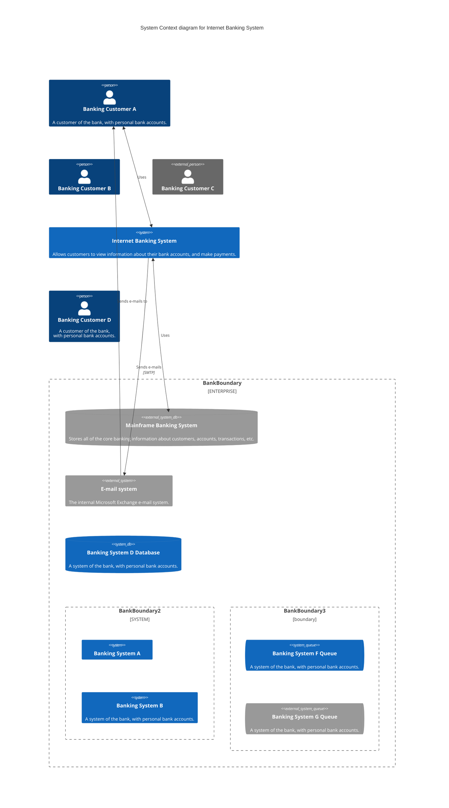

+++
title = "Golang Settings"
description="Keymap, Editor,..."
date = 2021-01-22T13:25:01+08:00
lastmod = 2022-03-17
featured_image = ""
draft = false
weight = 0
tags = ["go", "jetbrains"]
markmap = true
toc_markmap = true
toc_bootstrap = true
+++

## Visual studio Keymap

| name | hotkey | Desc |
| ---- | ---- | ---- |
| Open in terminal | 
| Show in Explorer | 
| Recent Files | 
| Go to Declaration or Usages | 
|  | 
| Split Right |  
| Split Down  | 
| Split and Move Down  | 
| Split and Move Right |  
| Close | 
| UnSplit | 
Goto Previous Splitter | 
Goto Next Splitter | 
Undo | 
Redo | 
Add to Watches | 
Move Caret Backward<br>a Paragraph | 
Move Caret Forward<br>a Paragraph | 
Add to Watches | 
Move Right |  (default)
Move Left |  (default)
Toggle Bookmark with Mnemonic |  (default) | 會有選單讓您設置書籤編號
Show Bookmarks |  (default) | 出現選單讓您選擇要到哪一個bookmark的標籤去
Toggle Bookmark | ,  | 按一次可以新增書籤(無編號書籤)，在以新增的書籤在按一次則取消書籤
Move Caret to Code Block Start |  | 跳到括號的開端
Move Caret to Code Block Start with Selection |  | 和上面的差別，這個會再把所選區域反白
Move Caret to Code Block End | 
Move Caret to Code Block End with Selection | 
Fold Selection / Remove region |  | 相當好用，相當於把當前的括號顯示或隱藏
Move Caret Backward a Paragraph |  | 往前移到整列為空白的列 (vim也有類似的指令: [shift + \[ ](https://vi.stackexchange.com/questions/10828/visual-select-from-cursor-to-next-empty-line))
Move Caret Forward a Paragraph |  | 往後移到整列為空白的列
Open source in new window |  (default) |
Reformat Code |  | 很好用，gitignore準備好，可以用這個取代go fmt |



| @@w=12em@@name | @@w=5em@@checked\n(☐☑) | Description | 設定位置 |
| ---- | :----: | ---- | ---- |
Add leading space to comments | ☑ | 可以在打完註解``//``自動多一個空白
Insert Paired brackets\n(), [], {}, <> | ☐  | 我是不喜歡這種設定，很愚蠢，每次打完還要再用方向鍵不能連著打 | Editor > General > Smart Keys
Insert pair quote | ☐  | 同上 | Editor > General > Smart Keys
Change font size with\n``Ctrl+Mouse Wheel`` | ☑ | 可以用滾輪來改變font-size



## 使用滑鼠滾輪來改變font-size

``Editor → General``:

☑ Change font size with ``Ctrl+Mouse Wheel``

## Editor

### Font

- Font: ``JetBrains Mono`` (或 ``Fira Code Retina``
- Size: 18

☑ Enable font ligatures: 這個選項勾起來之後，可以啟用連字，可以把``!=``做成像「``≠``」的效果！

## 關於go fmt

不需要特別用Plugins → Go → ``Go Fmt File``

可以運用預設的[Reformat Code]()

比較快，而且兩個的結果是一樣的

### FAQ

## [打開多個專案](https://www.jetbrains.com/help/webstorm/opening-reopening-and-closing-projects.html#ws_opening_multiple_projects)

造理說 [Open資料夾](https://www.jetbrains.com/help/webstorm/opening-reopening-and-closing-projects.html#ws_multiple_project_select_opening_policy) 預設會問你的附加方式是什麼

選擇Attach可以把資料夾附加到當前的專案下，但如果一直沒辦法成功

可以在

```
Settings > Project Structure

            + Add Content Root  (點選這個新增上去，也可以達到相同的效果
```

### IDE一直沒辦法讀取到正確的Module

```
Settings > Go > Go Modules

☑ Enable Go Modules Integration 這一項記得打勾
```

Enable Go Modules Integration : 這個東西指的就是go.mod

在舊版的go沒有go.mod這種東西(在go1.11前沒有(GO111MODULE的3個1就是指這個))，所以這項設定要自己去打開

其實我覺得要自動開啟了，新人我想都對go.mod略知一二，預設不開啟只是給人添麻煩而已。

### [Multiple packages in directory](https://intellij-support.jetbrains.com/hc/en-us/community/posts/4415202334098-Goland-2020-2-not-ignoring-go-build-tags)

go 1.18在一些原始的套件中，有的會使用

[go:build ignore](https://github.com/golang/go/blob/f229e70/src/math/rand/gen_cooked.go#L5-L12)

而如果您的jetbrains.IDE版本過舊，就會認為這個也是一個main，又由於main包的資料夾只能有一個，它就抱錯了，

升級您的IDE可以解決此問題。

### Table結尾少了分隔符

jetbrains/IDE 可以把Table自動貼齊，不過我覺得沒什麼意義，

md應該要隨處可用，不想以後被IDE綁住，

所以建議把相關的警告全部拿掉。

## JSON設定

- Settings -> Code Style -> JSON -> Wrapping and Braces

  可以對Arrays, Objects進行設定

  建議把Arrays改成`Wrap if long`，這樣可以將

    ```json
    {
      "data": [
          1,
          2,
          3
      ]
    }
    ```

  變成

    ```json
    {
      "data": [1, 2, 3]
    }
    ```

## Markdown MMD

MMD(MultiMarkdown). It supports more export-formats and implements some added features currently not available with plain Markdown syntax.

### [Mermaid](https://github.com/mermaid-js/mermaid)

[IDE設定](https://www.jetbrains.com/help/idea/markdown.html#diagrams)

```
Languages & Frameworks
    -> Markdown.
        -> [V] Enable either Mermaid or PlantUML under Markdown extensions.
```

> 上面的選項一定要打勾，如果沒安裝會自己去下載，即便你拿下載好的檔案放到指定資料夾也不行
>
> 如果下載失敗，請檢查防火牆，是否有阻擋到連線

> 其他參考連結
> - https://www.jetbrains.com/go/guide/tips/mermaid-js-support-in-markdown/


它會自動幫你下載，但是下載的版本可能是舊版的，導致有些語法會有問題，建議您可以把它替換掉

替換方法，來到此工作目錄

```yaml
%userprofile%\AppData\Local\JetBrains\GoLand2020.3\download-cache\mermaid\mermaid\mermaid.js
%LOCALAPPDATA%\JetBrains\GoLand2020.3\download-cache\mermaid\mermaid\mermaid.js # 同上
%LOCALAPPDATA%\JetBrains\GoLand2022.1\markdown\download\mermaidlanguageextension\mermaid # 不同版本所存放的位置可能不同，不一定都是在download-cache裡
```

如果您在以上的路徑都找不到mermaid.js不曉得要怎麼置換掉，我建議直接到goland資料夾，查找，例如:
```yaml
cd %LOCALAPPDATA%\JetBrains\GoLand2022.1
dir /s mermaid.js # 理論上這個指令會找到，因為您一定要先讓checkbox打勾，打勾之後會自動下載預設版本，再把這個版本置換成新的即可
```


> 補充: 其實[jetbrains常碰到的資料夾路徑](https://intellij-support.jetbrains.com/hc/en-us/articles/206544519-Directories-used-by-the-IDE-to-store-settings-caches-plugins-and-logs)
> - Configuration (idea.config.path): `%APPDATA%\JetBrains\IntelliJIdea2022.2`
> - Plugins (idea.plugins.path): `%APPDATA%\JetBrains\IntelliJIdea2022.2\plugins`
> - System (idea.system.path): `%LOCALAPPDATA%\JetBrains\IntelliJIdea2022.2`
> - Logs (idea.log.path): `%LOCALAPPDATA%\JetBrains\IntelliJIdea2022.2\log`

把mermaid.js替換掉即可，可以到此[下載mermaid.js](https://cdn.jsdelivr.net/npm/mermaid/dist/)

您可以載min.js，再把它更名就好了

```
pie title Pets adopted by volunteers
    "Dogs" : 386
    "Cats" : 85
    "Rats" : 15
```

成果如下

pie


C4Context

